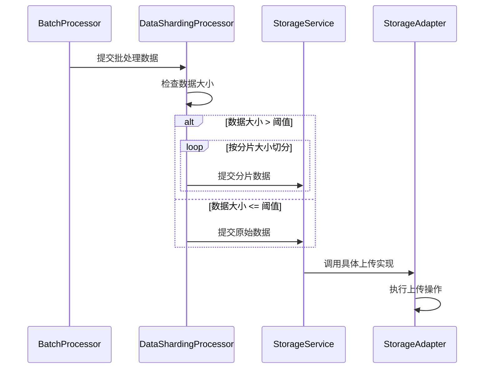

# 核心层数据分片处理设计文档

## 概述

本文档描述了在 LogX OSS Appender 的核心层实现的数据分片处理功能。该功能负责控制传递给存储适配器的数据大小，确保单个对象的大小符合云存储服务的要求。

## 设计目标

1. **统一控制**：在核心层统一控制数据分片，确保所有存储后端的行为一致性
2. **简化适配器**：移除存储适配器内部的分片逻辑，简化其实现
3. **可配置阈值**：支持配置分片阈值，默认为100MB
4. **透明处理**：对上层应用透明，无需关心数据分片细节

## 核心组件

### DataShardingProcessor
数据分片处理器，负责接收批处理数据并根据大小决定是否进行分片。

#### 主要功能
- 接收来自批处理器的数据
- 检查数据大小是否超过阈值
- 对超过阈值的数据进行分片处理
- 将分片后的数据传递给存储服务

#### 配置参数
- `shardingThreshold`: 分片阈值，默认100MB (100 * 1024 * 1024 bytes)
- `shardSize`: 分片大小，默认10MB (10 * 1024 * 1024 bytes)

### 分片策略

#### 分片算法
当数据大小超过阈值时，采用以下策略进行分片：
1. 将大数据按照固定的分片大小进行切分
2. 最后一个分片可能小于分片大小
3. 为每个分片生成唯一的键名，格式为：`original_key_part_0001`, `original_key_part_0002`, ...

#### 键名生成规则
- 原始键名：`logs/2025-09-24/application.log`
- 分片键名：`logs/2025-09-24/application.log_part_0001`, `logs/2025-09-24/application.log_part_0002`, ...

### 数据流



## 接口设计

### DataShardingProcessor 接口

```java
public interface DataShardingProcessor {
    /**
     * 处理数据分片
     * @param key 对象键
     * @param data 对象数据
     * @return CompletableFuture表示异步操作结果
     */
    CompletableFuture<Void> processSharding(String key, byte[] data);
    
    /**
     * 启动分片处理器
     */
    void start();
    
    /**
     * 停止分片处理器
     */
    void stop();
}
```

### 配置类

```java
public class ShardingConfig {
    private int shardingThreshold = 100 * 1024 * 1024; // 100MB
    private int shardSize = 10 * 1024 * 1024; // 10MB
    
    // getters and setters
}
```

## 实现细节

### 分片处理流程

1. 接收来自批处理器的数据
2. 检查数据大小是否超过阈值
3. 如果超过阈值：
   - 按照分片大小切分数据
   - 为每个分片生成唯一键名
   - 依次提交分片数据给存储服务
4. 如果未超过阈值：
   - 直接提交原始数据给存储服务

### 异常处理

- 分片过程中发生异常时，记录错误日志并尝试继续处理其他分片
- 如果某个分片上传失败，不影响其他分片的上传
- 提供分片上传的总体结果反馈

## 配置说明

通过以下配置项来控制数据分片行为：

```properties
# 启用数据分片功能
logx.sharding.enabled=true

# 分片阈值 (bytes)
logx.sharding.threshold=104857600

# 分片大小 (bytes)
logx.sharding.size=10485760
```

## 性能考虑

1. **内存使用**：分片处理在内存中进行，需要考虑大文件分片对内存的影响
2. **并发处理**：分片上传可以并发进行，提高上传效率
3. **资源保护**：与整体架构保持一致，确保不影响业务系统性能

## 测试策略

1. **单元测试**：验证分片算法的正确性
2. **集成测试**：验证与批处理器和存储服务的集成
3. **性能测试**：评估分片处理对整体性能的影响
4. **边界测试**：测试各种边界条件，如正好等于阈值的数据等