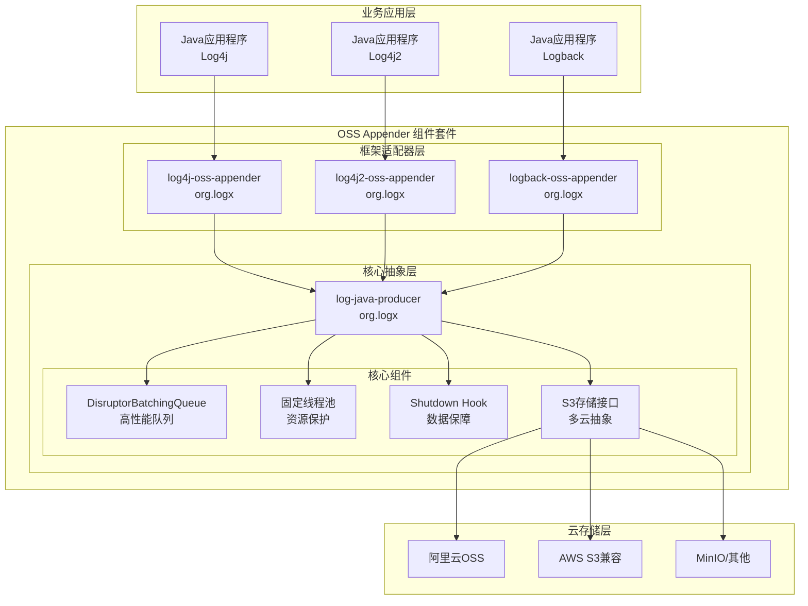
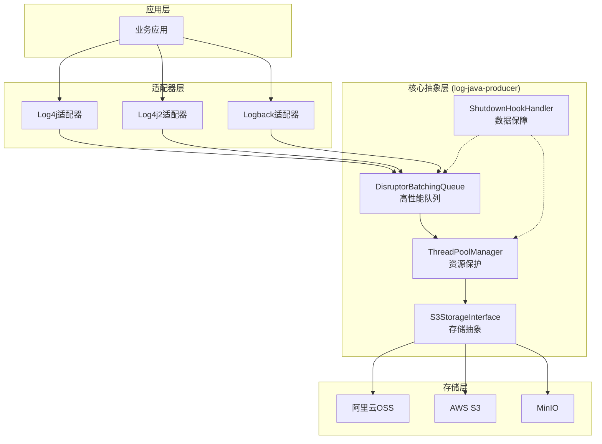
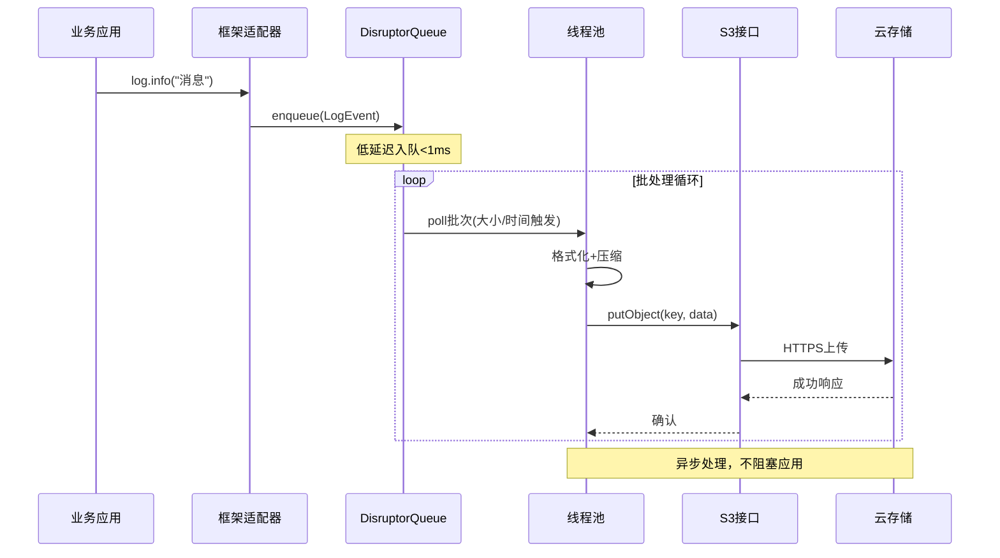
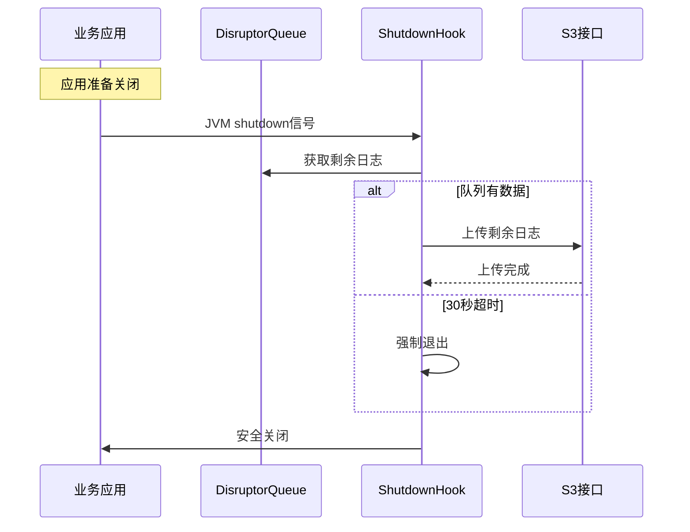

# OSS Appender 架构文档

## 项目介绍

本文档概述了 **OSS Appender** 高性能日志组件套件的整体架构，专注于**简洁、高性能、可切换**的代码实现。其主要目标是提供异步批量日志上传到云对象存储的能力，同时确保不影响业务系统性能。

**项目背景：**
基于2025-09-20技术架构头脑风暴会议的深度分析，OSS Appender重新定义了核心设计目标：通过高度抽象的log-java-producer和一致性的框架适配器，实现延迟最小、资源占用少、支持运行时存储切换的企业级日志解决方案。

### 核心设计原则

1. **简洁性**：log-java-producer高度抽象提取共性，各框架实现简洁一致
2. **高性能**：延迟最小 + 内存/CPU占用少 + 高吞吐量
3. **可切换性**：运行时存储后端切换 + 数据不丢失保证
4. **资源保护**：确保不影响业务系统，防止资源无限扩张

### 变更日志

| 日期 | 版本 | 描述 | 作者 |
|------|---------|-------------|--------|
| 2025-09-20 | 2.0 | 基于技术头脑风暴重新设计架构 | Mary (分析师) |
| 2025-09-20 | 1.0 | Git Submodules迁移的初始架构文档 | Winston (架构师) |

## 高层架构

### 技术概要

OSS Appender 采用**分层抽象架构**，其中log-java-producer作为高度抽象的核心层，提供基于S3标准的统一存储接口、LMAX Disruptor高性能队列管理和资源保护机制。三个框架适配器（log4j、log4j2、logback）作为简洁一致的集成层，确保配置统一和代码风格一致。架构的核心目标是**零业务影响**的高性能日志转发，通过固定线程池、低优先级调度和CPU让出机制实现资源保护，同时通过JVM shutdown hook确保数据不丢失。

### 高层概览

**架构风格：** 分层抽象 + 统一接口
- 核心抽象层：log-java-producer提取所有框架共性
- 适配器层：三个框架的简洁一致实现
- 存储抽象层：基于S3标准的多云支持

**技术栈：** Java 8+ + Maven + 高性能组件
- LMAX Disruptor：高性能异步队列
- S3兼容接口：统一的多云存储抽象
- 固定线程池：资源可控的异步处理

**主要数据流：**
应用程序 → 框架适配器 → DisruptorBatchingQueue → 批处理引擎 → S3存储接口 → 云存储

**关键架构决策：**
1. **S3标准统一**: 以S3 API为基础的存储抽象，简化多云支持
2. **资源保护优先**: 固定线程池+低优先级+CPU让出，确保不影响业务
3. **数据可靠性**: JVM shutdown hook + 30秒超时，保障数据不丢失
4. **配置一致性**: 三框架统一配置key，提升用户体验

### 高层项目图



### 架构和设计模式

- **抽象工厂模式**: S3存储接口提供统一的多云存储抽象 - _理由：_ 简化多云支持，降低vendor lock-in风险

- **生产者-消费者模式**: DisruptorBatchingQueue实现高性能异步处理 - _理由：_ 满足延迟最小和高吞吐量的性能要求

- **适配器模式**: 框架特定适配器统一到log-java-producer核心 - _理由：_ 实现简洁性原则，保持配置和代码一致性

- **资源保护模式**: 固定线程池+低优先级+CPU让出的组合策略 - _理由：_ 确保日志组件不影响业务系统性能

- **数据保障模式**: JVM shutdown hook + 超时机制 - _理由：_ 在保持简洁的同时实现数据不丢失

- **统一配置模式**: 三框架配置key保持一致 - _理由：_ 提升用户体验，降低学习成本

## 技术栈

### 核心技术选择

基于头脑风暴确定的技术选择，优先考虑性能、简洁性和资源保护：

### 技术栈表

| 类别 | 技术 | 版本 | 用途 | 设计原理 |
|----------|------------|---------|---------|-----------|
| **语言** | Java | 8+ | 主要开发语言 | 企业兼容性，确保广泛可用性 |
| **构建系统** | Maven | 3.9.6 | 构建和依赖管理 | 统一的父POM管理，简化版本控制 |
| **队列引擎** | LMAX Disruptor | 3.4.4 | 高性能异步队列 | 延迟最小，吞吐量最大的核心技术 |
| **存储SDK** | AWS SDK v2 | 2.28.16 | S3兼容接口 | S3标准统一抽象的技术基础 |
| **存储SDK** | Aliyun OSS SDK | 3.17.4 | 阿里云OSS | S3兼容模式下的主要目标平台 |
| **GroupId** | org.logx | - | 统一命名空间 | 简洁的组织标识，避免长命名 |
| **测试框架** | JUnit 5 | 5.10.1 | 单元测试 | 现代测试框架，支持并发测试 |
| **断言库** | AssertJ | 3.24.2 | 流式断言 | 提高测试代码可读性 |
| **静态分析** | SpotBugs | 4.8.3 | 代码质量 | 确保高质量代码交付 |

### 云基础设施

- **存储策略**: 多云S3兼容，优先OSS支持
- **网络要求**: HTTPS强制，TLS 1.2+
- **认证方式**: IAM Access Key/Secret Key

## 核心组件设计

### 1. log-java-producer (核心抽象层)

**设计目标**: 提取所有框架的共性功能，实现高度抽象

**核心组件**:

#### DisruptorBatchingQueue
```java
// 高性能队列管理
- 技术: LMAX Disruptor 3.4.4
- 容量控制: 失败重试3次 + 丢弃最老的 + 限制队列大小
- 批处理: 可配置大小和时间间隔
- 背压处理: 内存缓存 + 错误日志告警
```

#### S3StorageInterface
```java
// 统一存储抽象
public interface S3StorageInterface {
    void putObject(String key, byte[] data);
    // 基于S3标准，支持OSS/S3/MinIO
}
```

#### ThreadPoolManager
```java
// 资源保护的线程管理
- 固定线程池: 默认2个线程，可配置
- 低优先级: Thread.MIN_PRIORITY
- CPU让出: CPU繁忙时主动yield
- 优雅关闭: 配合shutdown hook
```

#### ShutdownHookHandler
```java
// 数据不丢失保障
- JVM shutdown hook注册
- 30秒超时上传剩余日志
- 线程池协调关闭
```

### 2. 框架适配器层

#### log4j-oss-appender
```java
// Log4j 1.x集成
- 继承: AppenderSkeleton
- 配置: 与log4j2/logback保持一致的key
- 转换: LoggingEvent → 内部LogEvent格式
```

#### log4j2-oss-appender
```java
// Log4j2集成
- 继承: AbstractAppender
- 配置: 统一配置key标准
- 异步: 优化的异步事件处理
```

#### logback-oss-appender
```java
// Logback集成
- 继承: AppenderBase<ILoggingEvent>
- 配置: 统一配置key标准
- SLF4J: 完整兼容性支持
```

### 组件交互图



## 核心工作流

### 正常日志处理流程



### 故障恢复流程



## 配置管理

### 统一配置标准

基于头脑风暴确定的配置一致性原则：

```xml
<!-- 三个框架的统一配置key -->
<appender name="OSS" class="org.logx.{framework}.OSSAppender">
    <!-- 必需参数 -->
    <endpoint>https://oss-cn-hangzhou.aliyuncs.com</endpoint>
    <accessKey>${OSS_ACCESS_KEY}</accessKey>
    <secretKey>${OSS_SECRET_KEY}</secretKey>
    <bucketName>my-log-bucket</bucketName>

    <!-- 性能参数 -->
    <batchSize>100</batchSize>
    <flushInterval>5000</flushInterval>

    <!-- 资源保护参数 -->
    <threadPoolSize>2</threadPoolSize>
    <maxQueueSize>10000</maxQueueSize>
</appender>
```

### 环境变量支持

```bash
# 推荐的环境变量配置
export OSS_ACCESS_KEY="your-access-key"
export OSS_SECRET_KEY="your-secret-key"
export OSS_BUCKET_NAME="your-bucket-name"
export OSS_ENDPOINT="https://oss-cn-hangzhou.aliyuncs.com"
```

## 性能设计

### 性能目标

基于头脑风暴确定的高性能要求：

| 指标 | 目标值 | 实现策略 |
|------|--------|----------|
| **写入延迟** | < 1ms (99%) | Disruptor无锁队列 |
| **吞吐量** | > 10万条/秒 | 批处理+异步上传 |
| **内存占用** | < 50MB | 有界队列+压缩 |
| **CPU占用** | < 5% | 低优先级+CPU让出 |

### 资源保护机制

```java
// 核心资源保护代码示例
public class ThreadPoolManager {
    private final ThreadPoolExecutor executor;

    public ThreadPoolManager(int poolSize) {
        this.executor = new ThreadPoolExecutor(
            poolSize, poolSize,
            0L, TimeUnit.MILLISECONDS,
            new LinkedBlockingQueue<>(1000), // 有界队列
            r -> {
                Thread t = new Thread(r);
                t.setPriority(Thread.MIN_PRIORITY); // 低优先级
                t.setDaemon(true);
                return t;
            }
        );
    }

    public void execute(Runnable task) {
        if (isCpuBusy()) {
            Thread.yield(); // CPU让出
        }
        executor.execute(task);
    }
}
```

## 错误处理策略

### 分层错误处理

基于简洁性原则的错误处理：

#### 队列层错误
- **队列满**: 丢弃最老数据，记录WARNING日志
- **处理失败**: 重试3次，失败后丢弃并记录ERROR日志

#### 存储层错误
- **网络错误**: 指数退避重试，最多3次
- **认证错误**: 立即失败，记录ERROR日志
- **服务限流**: 等待后重试，记录WARN日志

#### 应用层保护
- **异常隔离**: 所有异常在适配器层捕获，不传播到业务代码
- **降级策略**: 存储不可用时，继续正常日志输出到控制台

### 监控和告警

```java
// 基于日志的监控支持
logger.error("OSS upload failed after 3 retries",
    "batch_size={}, endpoint={}, error={}",
    batchSize, endpoint, exception.getMessage());

logger.warn("Queue capacity exceeded, dropping {} old entries",
    droppedCount);

logger.info("OSS appender performance: avg_latency={}ms, throughput={}/s",
    avgLatency, throughput);
```

## 部署和集成

### Maven依赖

```xml
<!-- 选择对应的框架适配器 -->
<dependency>
    <groupId>org.logx</groupId>
    <artifactId>log4j-oss-appender</artifactId>
    <version>1.0.0</version>
</dependency>

<dependency>
    <groupId>org.logx</groupId>
    <artifactId>log4j2-oss-appender</artifactId>
    <version>1.0.0</version>
</dependency>

<dependency>
    <groupId>org.logx</groupId>
    <artifactId>logback-oss-appender</artifactId>
    <version>1.0.0</version>
</dependency>
```

### 生产环境部署

#### 容器化部署
```dockerfile
# 环境变量配置
ENV OSS_ACCESS_KEY=""
ENV OSS_SECRET_KEY=""
ENV OSS_BUCKET_NAME="app-logs"
ENV OSS_ENDPOINT="https://oss-cn-hangzhou.aliyuncs.com"
```

#### Spring Boot集成
```yaml
# application.yml
logging:
  config: classpath:logback-spring.xml

# 推荐的生产配置
oss:
  appender:
    batch-size: 500
    flush-interval: 10000
    thread-pool-size: 4
```

## 安全考虑

### 认证和授权
- **IAM最佳实践**: 使用最小权限原则
- **凭据管理**: 环境变量或云厂商凭据服务
- **网络安全**: 强制HTTPS/TLS 1.2+

### 数据保护
- **传输加密**: 所有云存储通信使用TLS
- **静态加密**: 云厂商托管的服务端加密
- **敏感数据**: 避免在日志中记录凭据或敏感信息

## 测试策略

### 测试覆盖

基于头脑风暴确定的质量要求：

- **单元测试**: 覆盖率 > 90%，重点测试核心组件
- **集成测试**: 多云存储兼容性测试
- **性能测试**: 延迟和吞吐量基准测试
- **并发测试**: 多线程场景下的数据一致性

### 测试工具

```java
// 性能测试示例
@Test
void testHighThroughput() {
    // 测试10万条日志的处理性能
    int logCount = 100000;
    long startTime = System.currentTimeMillis();

    for (int i = 0; i < logCount; i++) {
        logger.info("Test message {}", i);
    }

    long duration = System.currentTimeMillis() - startTime;
    double throughput = logCount * 1000.0 / duration;

    assertThat(throughput).isGreaterThan(100000); // 10万条/秒
}
```

## 后续步骤

### 实施优先级

基于头脑风暴确定的开发计划：

#### 阶段1: 核心功能实现 (2-3周)
1. **S3抽象接口设计** (2-3天)
2. **log-java-producer核心** (1周)
3. **框架适配器开发** (1周)

#### 阶段2: 可靠性增强 (1-2周)
- JVM shutdown hook机制
- 数据不丢失测试验证
- 错误处理完善

#### 阶段3: 性能优化 (持续)
- 性能基准测试
- 调优指南编写
- 监控能力增强

---

*本架构文档基于2025-09-20技术头脑风暴会议结果编写，体现了简洁、高性能、可切换的核心设计理念。所有技术决策都以不影响业务系统为前提，确保企业级的稳定性和可靠性。*

🤖 Generated with [Claude Code](https://claude.ai/code) & BMAD™ Core