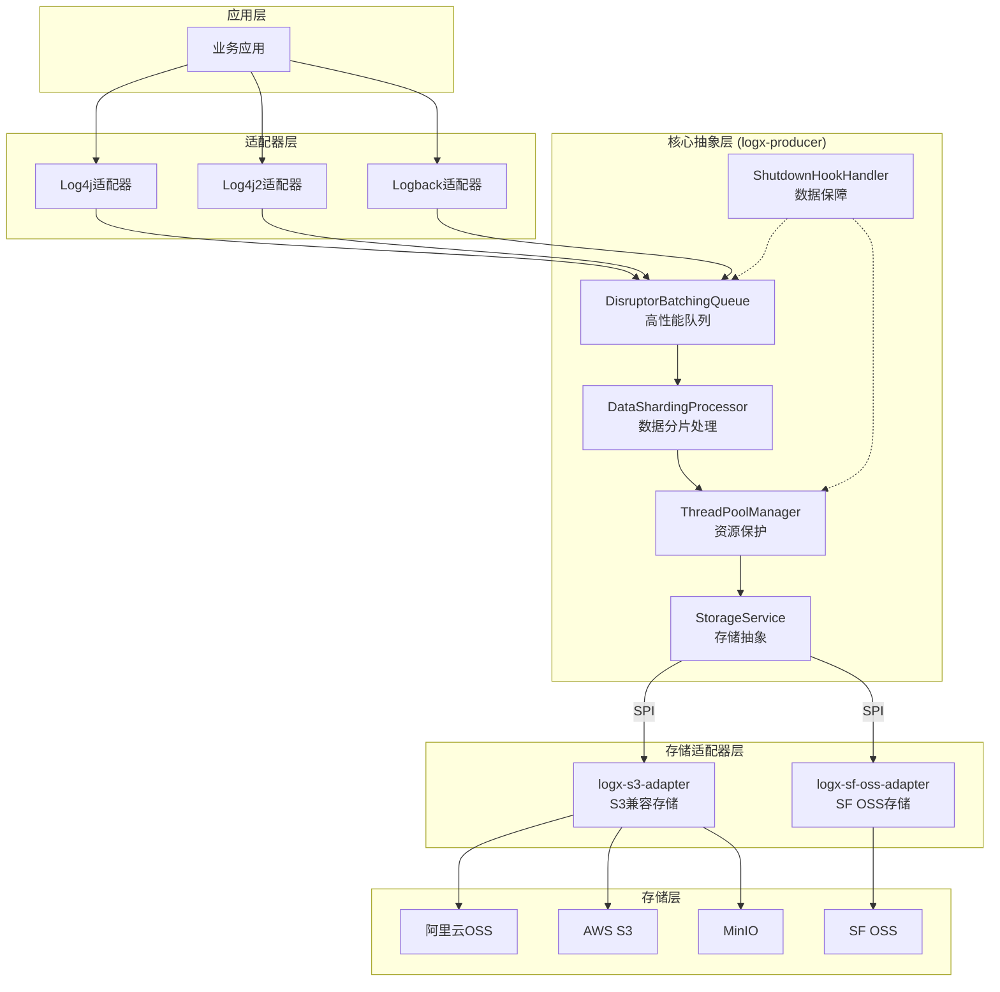
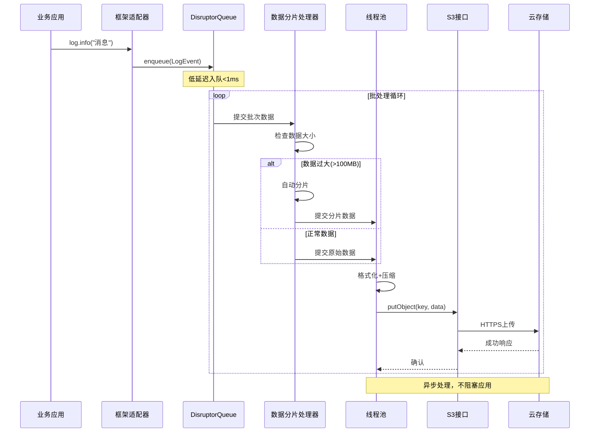
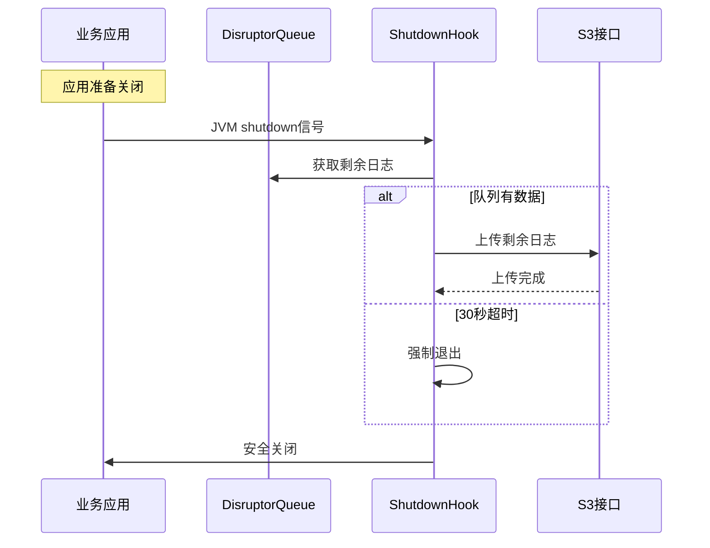

# LogX OSS Appender 架构文档

## 项目介绍

本文档概述了 **LogX OSS Appender** 高性能日志组件套件的整体架构，专注于**简洁、高性能、可切换**的代码实现。其主要目标是提供异步批量日志上传到云对象存储的能力，同时确保不影响业务系统性能。

**项目背景：**
基于2025-09-20技术架构头脑风暴会议的深度分析，OSS Appender重新定义了核心设计目标：通过高度抽象的logx-producer和一致性的框架适配器，实现延迟最小、资源占用少、支持运行时存储切换的企业级日志解决方案。

### 核心设计原则

1. **简洁性**：logx-producer高度抽象提取共性，各框架实现简洁一致
2. **高性能**：延迟最小 + 内存/CPU占用少 + 高吞吐量
3. **可切换性**：运行时存储后端切换 + 数据不丢失保证
4. **资源保护**：确保不影响业务系统，防止资源无限扩张
5. **低侵入性**：用户按需引入存储适配器，避免不必要的依赖

### 变更日志

| 日期 | 版本 | 描述 | 作者 |
|------|---------|-------------|--------|
| 2025-09-24 | 2.1 | 更新数据处理流程，核心层控制数据分片 | Winston (架构师) |
| 2025-09-20 | 2.0 | 基于技术头脑风暴重新设计架构 | Mary (分析师) |
| 2025-09-20 | 1.0 | 单仓库多模块架构的初始架构文档 | Winston (架构师) |

## 高层架构

### 技术概要

OSS Appender 采用**分层抽象架构**，其中logx-producer作为高度抽象的核心层，提供基于存储服务接口的统一抽象、LMAX Disruptor高性能队列管理和资源保护机制。三个框架适配器（log4j、log4j2、logback）作为简洁一致的集成层，确保配置统一和代码风格一致。架构的核心目标是**零业务影响**的高性能日志转发，通过固定线程池、低优先级调度和CPU让出机制实现资源保护，同时通过JVM shutdown hook确保数据不丢失。

通过模块化设计和Java SPI机制，我们将具体的云存储SDK依赖分离到独立的适配器模块中，用户可以根据需要选择引入相应的适配器，从而实现低侵入性的架构设计。

### 高层概览

**架构风格：** 分层抽象 + 统一接口 + 模块化设计
- 核心抽象层：logx-producer提取所有框架共性
- 适配器层：三个框架的简洁一致实现
- 存储抽象层：基于存储服务接口的多云支持
- 模块化层：独立的云存储适配器模块

**技术栈：** Java 8+ + Maven + 高性能组件
- LMAX Disruptor：高性能异步队列
- 存储服务接口：统一的多云存储抽象
- 固定线程池：资源可控的异步处理
- Java SPI：运行时服务发现机制

**主要数据流：**
应用程序 → 框架适配器 → DisruptorBatchingQueue → 批处理引擎 → 存储服务接口 → 云存储适配器 → 云存储

**关键架构决策：**

## 技术栈

| 组件 | 名称 | 版本 | 用途 | 备注 |
|------|------|------|------|------|
| **语言** | Java | 8+ | 核心开发语言 | 兼容性优先 |
| **构建工具** | Maven | 3.9.6 | 项目构建 | 模块化管理 |
| **高性能队列** | LMAX Disruptor | 3.4.4 | 异步处理 | 核心依赖 |
| **云存储SDK** | AWS SDK | 2.28.16 | S3兼容存储 | 云存储适配 |
| **测试框架** | JUnit 5 | 5.10.1 | 单元测试 | 现代测试框架，支持并发测试 |
| **断言库** | AssertJ | 3.24.2 | 流式断言 | 提高测试代码可读性 |
| **静态分析** | SpotBugs | 4.8.3 | 代码质量 | 确保高质量代码交付 |

### 云基础设施

- **存储策略**: 多云S3兼容，优先OSS支持
- **网络要求**: HTTPS强制，TLS 1.2+
- **认证方式**: IAM Access Key/Secret Key

## 核心组件设计

### 1. logx-producer (核心抽象层)

**设计目标**: 提取所有框架的共性功能，实现高度抽象

**核心组件**:

#### DisruptorBatchingQueue
```java
// 高性能队列管理
- 技术: LMAX Disruptor 3.4.4
- 容量控制: 失败重试3次 + 丢弃最老的 + 限制队列大小
- 批处理: 可配置大小和时间间隔
- 背压处理: 内存缓存 + 错误日志告警
```

#### StorageService
```java
// 统一存储抽象
public interface StorageService {
    CompletableFuture<Void> putObject(String key, byte[] data);
    String getBackendType();
    String getBucketName();
    void close();
    boolean supportsBackend(String backendType);
}
```

#### DataShardingProcessor (新增)
```java
// 数据分片处理器
- 控制传递给存储适配器的数据大小
- 自动分片大文件（>100MB）
- 简化存储适配器实现
```

#### ThreadPoolManager
```java
// 资源保护的线程管理
- 固定线程池: 默认2个线程，可配置
- 低优先级: Thread.MIN_PRIORITY
- CPU让出: CPU繁忙时主动yield
- 优雅关闭: 配合shutdown hook
```

#### ShutdownHookHandler
```java
// 数据不丢失保障
- JVM shutdown hook注册
- 30秒超时上传剩余日志
- 线程池协调关闭
```

### 2. 框架适配器层

#### log4j-oss-appender
```java
// Log4j 1.x集成
- 继承: AppenderSkeleton
- 配置: 与log4j2/logback保持一致的key
- 转换: LoggingEvent → 内部LogEvent格式
```

#### log4j2-oss-appender
```java
// Log4j2集成
- 继承: AbstractAppender
- 配置: 统一配置key标准
- 异步: 优化的异步事件处理
```

#### logback-oss-appender
```java
// Logback集成
- 继承: AppenderBase<ILoggingEvent>
- 配置: 统一配置key标准
- SLF4J: 完整兼容性支持
```

### 3. 存储适配器层 (简化后)

#### logx-s3-adapter
```java
// S3兼容存储适配器
- 只负责具体的上传实现
- 不再处理数据分片逻辑
- 依赖核心层的数据分片处理
- 不再提供putObjects方法，只提供putObject方法
```

#### logx-sf-oss-adapter
```java
// SF OSS存储适配器
- 只负责具体的上传实现
- 不再提供putObjects方法，只提供putObject方法
- 依赖核心层的数据分片处理
```

### 组件交互图



## 核心工作流

### 正常日志处理流程



### 故障恢复流程



## 配置管理

### 统一配置标准

基于头脑风暴确定的配置一致性原则：

```xml
<!-- 三个框架的统一配置key -->