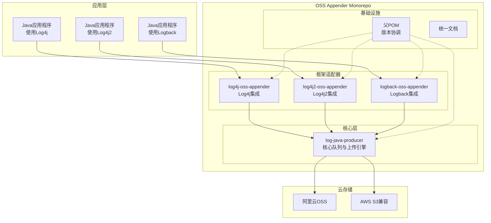
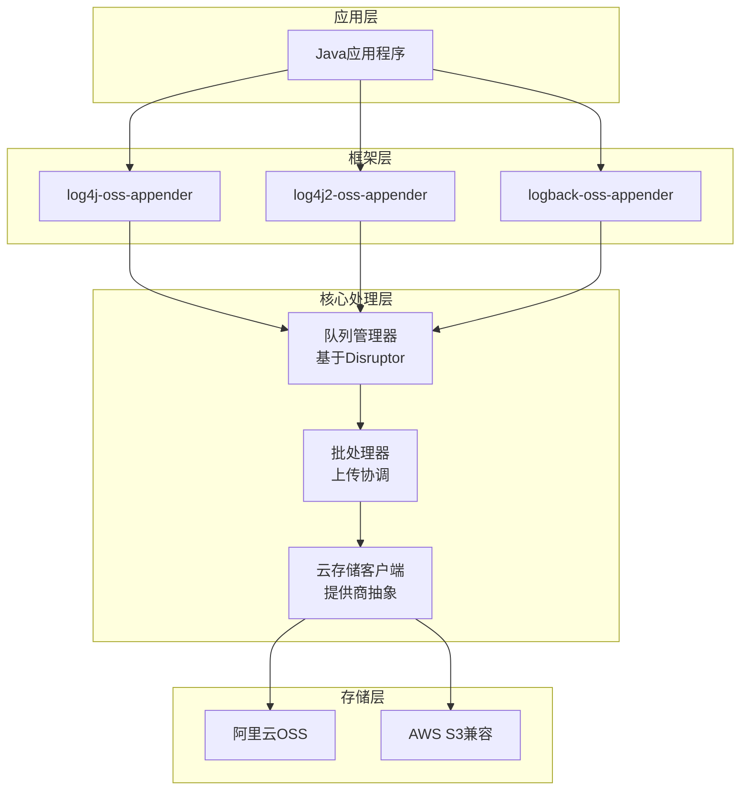
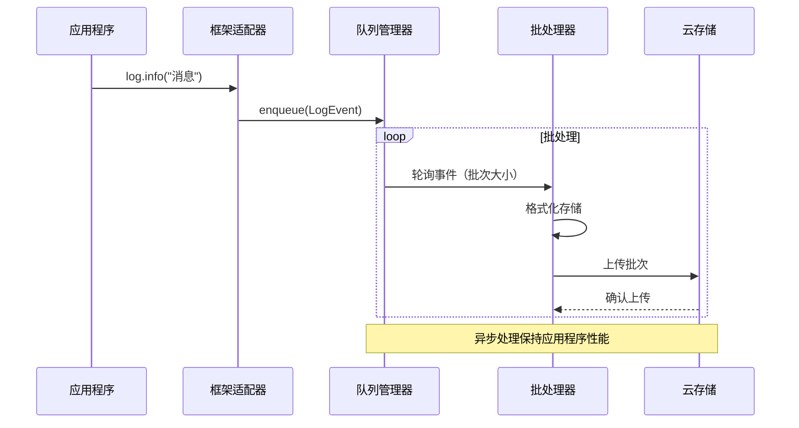

# OSS Appender 架构文档

## 项目介绍

本文档概述了 **OSS Appender** 的整体项目架构，包括后端系统、共享服务和非UI相关的技术关注点。其主要目标是作为AI驱动开发的指导性架构蓝图，确保所选模式和技术的一致性和遵循性。

**与前端架构的关系：**
由于 OSS Appender 是一个纯后端库项目，没有用户界面组件，本文档代表了完整的架构规范。重点关注基于Maven的Java库架构、模块组织和日志框架集成模式。

**项目背景：**
本架构支持将四个独立Git仓库迁移到统一monorepo结构的棕地增强项目，使用Git Submodules进行管理，同时保持现有的Java库生态系统和基于Maven的构建流程。

### 启动模板或现有项目

基于PRD分析，本项目是**具有现有基础设施的棕地项目**：

**当前状态：**
- 四个现有的基于Maven的Java项目，具有既定的git历史
- 遵循标准Maven约定的现有项目结构
- 已建立的依赖关系（log-java-producer作为核心依赖）
- 正常运行的构建流程和Maven Central发布工作流

**迁移方法：**
- **无需启动模板** - 我们保留现有项目结构
- 每个子模块维护其当前的Maven项目布局
- 将创建父POM来协调版本管理
- 现有工具（Maven、IDE）将继续工作，变更最小

**理由：** 由于这是仓库结构迁移而非绿地项目，我们保留所有现有的Maven约定、包结构和构建配置。子模块方法允许在实现统一管理收益的同时保持向后兼容性。

### 变更日志

| 日期 | 版本 | 描述 | 作者 |
|------|---------|-------------|--------|
| 2025-09-20 | 1.0 | Git Submodules迁移的初始架构文档 | Winston (架构师) |

## 高层架构

### 技术概要

OSS Appender 采用**模块化monorepo架构**，使用Git Submodules协调四个专门的Maven库模块。系统遵循**依赖分层模式**，其中核心基础模块（log-java-producer）提供共享队列管理和上传功能，而三个框架特定的适配器（log4j、log4j2、logback）为不同的日志生态系统提供集成点。架构优先考虑**高性能异步处理**，使用Disruptor模式进行日志批处理和上传协调，实现企业级日志转发到云对象存储服务，同时最小化应用程序性能影响。

### 高层概览

**架构风格：** 使用Git Submodules的模块化Monorepo
- 协调开发与独立部署能力
- 共享版本管理与模块特定发布灵活性

**仓库结构：** Monorepo（来自PRD技术假设）
- 包含四个子模块的单一主仓库
- 保留每个组件的独立git历史
- 统一的文档和配置管理

**服务架构：** 库组件套件
- 提供共享能力的核心基础层
- 用于日志集成的框架特定适配器层
- 允许选择性框架采用的插件架构

**主要数据流：**
应用程序 → 日志框架 → OSS Appender → Disruptor队列 → 批处理器 → 云存储（OSS/S3）

**关键架构决策：**
1. **子模块协调：** 平衡统一管理与模块自治
2. **依赖分层：** 核心关注点与框架特定关注点的清晰分离
3. **异步处理：** 非阻塞日志转发保持应用程序性能
4. **云存储抽象：** 透明支持多个对象存储提供商

### 高层项目图



### 架构和设计模式

- **仓库模式：** Git Submodule协调在启用统一管理的同时保持模块独立性 - _理由：_ 保留现有开发工作流，同时添加PRD中指定的协调优势

- **依赖注入模式：** 框架适配器将日志事件注入核心处理引擎 - _理由：_ 在框架特定代码和核心处理逻辑之间实现松耦合

- **生产者-消费者模式：** 基于Disruptor的异步队列处理，用于高性能日志转发 - _理由：_ 满足企业性能要求，同时保持应用程序响应性

- **策略模式：** 通过统一接口的可插拔云存储提供商（OSS vs S3） - _理由：_ 支持多云部署和供应商灵活性，如当前代码库中所识别

- **插件架构：** 框架特定适配器作为具有共享核心依赖的独立模块 - _理由：_ 允许应用程序只包含所需的日志框架集成，减少依赖占用

- **版本协调模式：** 父POM管理共享依赖，同时保持模块自治 - _理由：_ 解决PRD对统一版本管理的要求，而不强制耦合发布

## 技术栈

### 云基础设施

- **提供商：** 多云支持（阿里云 + AWS兼容）
- **核心服务：** 对象存储（OSS、S3），不需要计算服务
- **部署区域：** 根据部署环境可配置

### 技术栈表

| 类别 | 技术 | 版本 | 用途 | 理由 |
|----------|------------|---------|---------|-----------|
| **语言** | Java | 8 | 主要开发语言 | 最大化企业兼容性，满足PRD要求的Java 8+支持 |
| **构建系统** | Maven | 3.9.6 | 构建自动化和依赖管理 | 当前项目标准，库项目的成熟可靠性 |
| **运行时** | OpenJDK | 8u392 | Java运行时环境 | 长期支持版本，最广泛的企业采用 |
| **队列库** | LMAX Disruptor | 3.4.4 | 高性能异步处理 | 现有核心依赖，经过验证的性能特征 |
| **云SDK (AWS)** | AWS SDK for Java v2 | 2.28.16 | S3兼容存储集成 | 来自PRD的当前版本，稳定API |
| **云SDK (阿里云)** | Aliyun OSS SDK | 3.17.4 | 阿里云OSS集成 | 来自PRD的当前版本，主要目标平台 |
| **测试框架** | JUnit | 5.10.1 | 单元测试 | 行业标准，优秀的IDE集成 |
| **模拟库** | Mockito | 5.8.0 | 测试替身和验证 | 标准模拟框架，与JUnit 5良好集成 |
| **断言库** | AssertJ | 3.24.2 | 流式测试断言 | 比JUnit默认断言更可读 |
| **静态分析** | SpotBugs | 4.8.3 | 代码质量和缺陷检测 | 可用Maven插件，捕获常见问题 |
| **代码格式化** | Maven Formatter Plugin | 2.23.0 | 代码风格强制 | 确保模块间代码格式一致性 |
| **依赖扫描** | OWASP Dependency Check | 9.0.7 | 安全漏洞扫描 | 对分发到Maven Central的库项目至关重要 |
| **文档生成** | Maven Javadoc Plugin | 3.6.3 | API文档生成 | Java库标准，Maven Central要求 |

## 数据模型

### LogEvent

**用途：** 表示要处理和上传的日志条目的核心数据结构

**关键属性：**
- timestamp: long - 事件发生时间（毫秒）
- level: LogLevel enum - 严重性级别（DEBUG、INFO、WARN、ERROR）
- message: String - 格式化的日志消息内容
- loggerName: String - 源日志器标识符
- threadName: String - 发起线程名称
- exception: Throwable - 可选的异常详情

**关系：**
- 由QueueManager处理进行批处理
- 转换为StorageObject进行上传

### AppenderConfiguration

**用途：** 云存储和处理行为的配置设置

**关键属性：**
- endpoint: String - 云存储服务端点
- accessKey: String - 身份验证凭据
- secretKey: String - 身份验证凭据
- bucketName: String - 目标存储桶
- batchSize: int - 每批上传事件数
- flushInterval: long - 最大批处理等待时间

**关系：**
- 由CloudStorageClient实现使用
- 在初始化期间验证连接设置

## 组件

### log-java-producer

**职责：** 提供异步日志处理、队列管理和云存储上传功能的核心引擎

**关键接口：**
- QueueManager: 使用Disruptor的高性能事件队列
- CloudStorageClient: 存储提供商的抽象接口
- BatchProcessor: 协调批处理和上传操作

**依赖：** Disruptor库，云SDK依赖

**技术栈：** Java 8，Disruptor 3.4.4，AWS SDK 2.28.16，Aliyun OSS SDK 3.17.4

### log4j-oss-appender

**职责：** Log4j 1.x集成适配器，捕获日志事件并转发到核心处理引擎

**关键接口：**
- AppenderSkeleton扩展：标准Log4j appender接口
- EventConverter：将Log4j LoggingEvent转换为内部LogEvent格式

**依赖：** log-java-producer，Log4j 1.x（provided作用域）

**技术栈：** Log4j 1.x API，从log-java-producer继承核心处理

### log4j2-oss-appender

**职责：** Log4j2集成适配器，提供现代异步日志功能

**关键接口：**
- AbstractAppender扩展：Log4j2 appender框架集成
- AsyncEventHandler：为Log4j2异步模型优化的事件处理

**依赖：** log-java-producer，Log4j2 Core（provided作用域）

**技术栈：** Log4j2 API，从log-java-producer继承核心处理

### logback-oss-appender

**职责：** Logback框架集成适配器，具有SLF4J兼容性

**关键接口：**
- AppenderBase扩展：标准Logback appender接口
- LogbackEventConverter：将ILoggingEvent转换为内部格式

**依赖：** log-java-producer，Logback Classic（provided作用域）

**技术栈：** Logback API，SLF4J，从log-java-producer继承核心处理

### 组件图



## 核心工作流



## 源码树结构

```plaintext
oss-appender/                           # 主仓库根目录
├── .bmad-core/                         # BMAD配置和模板
│   ├── core-config.yaml               # 项目配置
│   └── tasks/                          # 开发任务
├── docs/                               # 统一文档
│   ├── architecture.md                # 本文档
│   ├── prd.md                         # 产品需求
│   └── developer-guide.md             # 设置和工作流指南
├── log-java-producer/                 # [子模块] 核心处理引擎
│   ├── src/main/java/io/github/ossappender/
│   ├── pom.xml                        # 模块POM
│   └── README.md                      # 模块文档
├── log4j-oss-appender/                # [子模块] Log4j集成
│   ├── src/main/java/io/github/ossappender/log4j/
│   ├── pom.xml                        # 模块POM
│   └── README.md                      # 模块文档
├── log4j2-oss-appender/               # [子模块] Log4j2集成
│   ├── src/main/java/io/github/ossappender/log4j2/
│   ├── pom.xml                        # 模块POM
│   └── README.md                      # 模块文档
├── logback-oss-appender/              # [子模块] Logback集成
│   ├── src/main/java/io/github/ossappender/logback/
│   ├── pom.xml                        # 模块POM
│   └── README.md                      # 模块文档
├── .gitmodules                        # Git子模块配置
├── pom.xml                            # 父POM与版本协调
└── README.md                          # 项目概览和快速开始
```

## 基础设施和部署

### 基础设施即代码
- **工具：** Maven 3.9.6（构建协调）
- **位置：** `pom.xml`（父级），模块特定POM
- **方法：** 声明式依赖和版本管理

### 部署策略
- **策略：** 独立模块发布到Maven Central
- **CI/CD平台：** GitHub Actions（推荐用于开源）
- **管道配置：** `.github/workflows/` 目录

### 环境
- **开发：** 本地开发，基于文件的测试
- **预发布：** 使用测试云存储桶的集成测试
- **生产：** Maven Central发布和文档托管

### 环境推进流程
```text
开发 → 预发布 → 生产
 ↓      ↓       ↓
本地构建 → CI构建 → 发布构建
```

### 回滚策略
- **主要方法：** 基于Git标签的版本回滚
- **触发条件：** 集成测试失败，安全漏洞
- **恢复时间目标：** 最长4小时

## 错误处理策略

### 通用方法
- **错误模型：** 基于异常的自定义层次结构
- **异常层次结构：** OSS Appender基础异常扩展RuntimeException
- **错误传播：** 配置错误快速失败，上传失败优雅降级

### 日志标准
- **库：** SLF4J 1.7.36 API
- **格式：** 带上下文信息的结构化日志
- **级别：** ERROR（上传失败），WARN（配置问题），INFO（操作事件），DEBUG（详细跟踪）
- **必需上下文：**
  - 关联ID：批次跟踪的UUID格式
  - 服务上下文：模块名称和版本
  - 用户上下文：无个人数据，仅配置标识符

### 错误处理模式

#### 外部API错误
- **重试策略：** 带抖动的指数退避，最多3次尝试
- **断路器：** 连续5次失败后打开断路器
- **超时配置：** 30秒连接，60秒读取
- **错误转换：** 将云提供商错误映射到OSS Appender异常

#### 业务逻辑错误
- **自定义异常：** ConfigurationException、UploadException、QueueException
- **面向用户的错误：** 清晰的错误消息与纠正措施
- **错误代码：** 用于程序化处理的结构化错误代码

#### 数据一致性
- **事务策略：** 云存储的单阶段提交
- **补偿逻辑：** 重试失败的上传，带重复检测
- **幂等性：** 基于UUID的上传操作去重

## 编码标准

### 核心标准
- **语言和运行时：** Java 8（最低Java 8兼容性）
- **风格和检查：** Maven Formatter Plugin 2.23.0，SpotBugs 4.8.3
- **测试组织：** `src/test/java`中的JUnit 5测试，匹配包结构

### 命名约定

| 元素 | 约定 | 示例 |
|---------|------------|---------|
| 类 | PascalCase | `QueueManager` |
| 方法 | camelCase | `processLogEvent` |
| 常量 | UPPER_SNAKE_CASE | `DEFAULT_BATCH_SIZE` |
| 包 | lowercase.dotted | `io.github.ossappender.core` |

### 关键规则
- **日志：** 使用SLF4J进行内部日志，生产代码中绝不使用System.out
- **异常处理：** 将云存储异常包装在库特定异常中
- **线程安全：** 所有公共API必须是线程安全的，记录任何例外
- **配置：** 对配置对象使用构建器模式
- **依赖：** 将日志框架标记为'provided'作用域以避免冲突

## 测试策略和标准

### 测试理念
- **方法：** 开发后测试，全面覆盖
- **覆盖目标：** 85%行覆盖率，核心模块90%分支覆盖率
- **测试金字塔：** 70%单元测试，25%集成测试，5%端到端测试

### 测试类型和组织

#### 单元测试
- **框架：** JUnit 5.10.1
- **文件约定：** `src/test/java`中的`*Test.java`
- **位置：** 镜像主包结构
- **模拟库：** Mockito 5.8.0
- **覆盖要求：** 核心处理逻辑最低85%

**AI代理要求：**
- 为所有公共方法生成测试
- 覆盖边缘情况和错误条件
- 遵循AAA模式（Arrange、Act、Assert）
- 模拟所有外部依赖

#### 集成测试
- **范围：** 云存储集成，框架适配器集成
- **位置：** `src/test/java`，带`@Tag("integration")`
- **测试基础设施：**
  - **云存储：** 使用MinIO的Testcontainers进行S3兼容性测试
  - **消息队列：** 内存中Disruptor用于快速测试执行

#### 端到端测试
- **框架：** JUnit 5.10.1与自定义测试工具
- **范围：** 从框架到存储的完整日志流程
- **环境：** 与真实云存储的隔离测试环境
- **测试数据：** 具有已知模式的生成测试日志

### 测试数据管理
- **策略：** 用于测试数据创建的构建器模式
- **固定装置：** 复杂配置场景的JSON文件
- **工厂：** 带随机化的程序化测试数据生成
- **清理：** 每个测试方法后自动清理

### 持续测试
- **CI集成：** 每次提交进行单元测试，PR合并时进行集成测试
- **性能测试：** 发布候选版本的吞吐量基准测试
- **安全测试：** OWASP依赖扫描和静态分析

## 安全

### 输入验证
- **验证库：** 内置Java验证与自定义验证器
- **验证位置：** 队列前的框架适配器层
- **必需规则：**
  - 所有外部输入必须验证
  - 处理前在API边界验证
  - 白名单方法优于黑名单

### 身份验证和授权
- **认证方法：** 云提供商IAM集成（Access Key/Secret Key）
- **会话管理：** 无状态设计，无需会话管理
- **必需模式：**
  - 初始化时的凭据验证
  - 安全的凭据存储和传输

### 密钥管理
- **开发：** 环境变量和安全的本地属性文件
- **生产：** 云提供商凭据管理（优选IAM角色）
- **代码要求：**
  - 绝不硬编码密钥
  - 仅通过配置服务访问
  - 日志或错误消息中无密钥

### API安全
- **速率限制：** 云提供商原生速率限制
- **CORS策略：** 不适用（库项目）
- **安全标头：** 不适用（库项目）
- **HTTPS强制：** 所有云存储连接必需

### 数据保护
- **静态加密：** 云提供商托管加密（AES-256）
- **传输加密：** 所有云存储通信使用TLS 1.2+
- **PII处理：** 无PII处理，客户负责日志内容
- **日志限制：** 绝不记录凭据，最小化敏感数据暴露

### 依赖安全
- **扫描工具：** OWASP Dependency Check 9.0.7
- **更新策略：** 月度安全更新，关键补丁立即应用
- **审批流程：** CI/CD管道中的自动扫描，HIGH/CRITICAL漏洞时失败

### 安全测试
- **SAST工具：** SpotBugs 4.8.3与安全规则
- **DAST工具：** 不适用（库项目）
- **渗透测试：** 年度第三方安全审查

## 后续步骤

### 开发交接

架构已完成并准备实施。开发团队应该：

1. **从PRD的Story 1.1开始** - 建立主仓库基础设施
2. **使用本架构文档**作为权威技术规范
3. **参考技术栈表**进行所有依赖和版本决策
4. **遵循源码树结构**来组织monorepo

### 实施优先级

1. **仓库设置** - 创建父POM和目录结构
2. **子模块迁移** - 按照PRD故事序列转换现有仓库
3. **集成测试** - 验证所有模块交互正常工作
4. **文档** - 完成开发者指南和API文档
5. **CI/CD集成** - 建立自动化构建和发布流程

---

*本文档作为OSS Appender Git Submodule迁移的完整架构规范。所有实施决策都应参考本文档作为唯一真实来源。*

🤖 Generated with BMAD™ Core