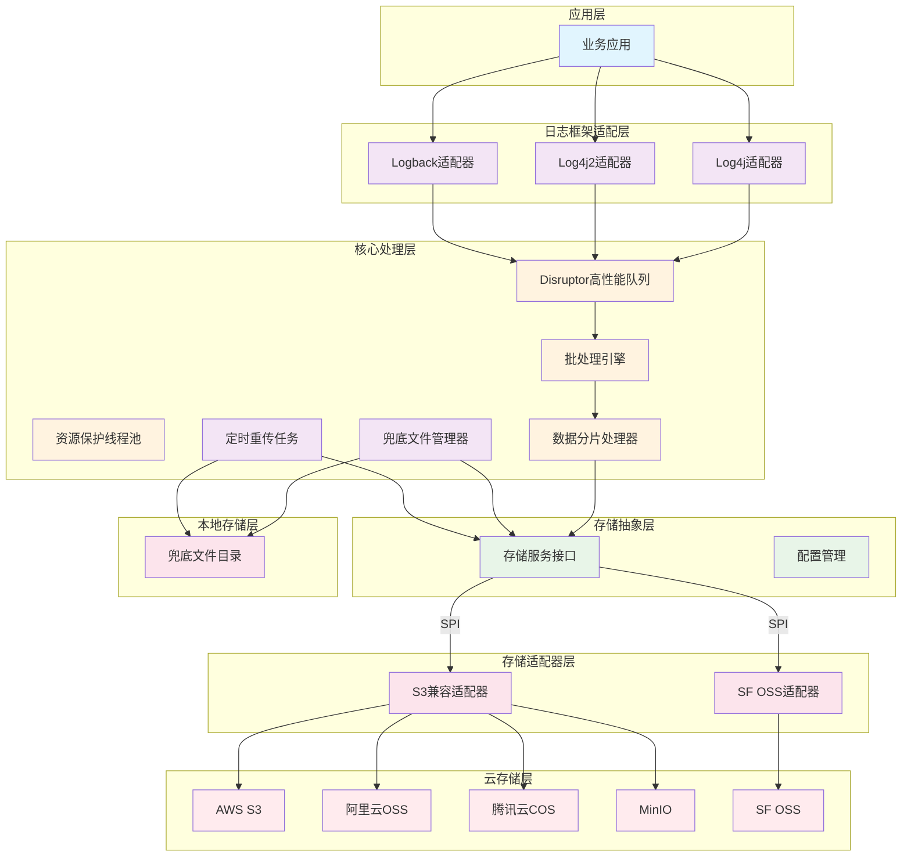
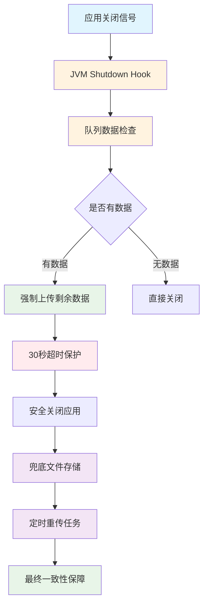
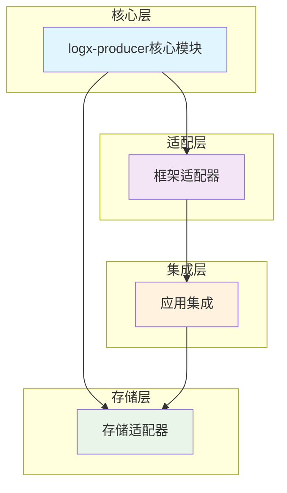

# LogX OSS Appender 技术方案文档

## 1. 项目概述

LogX OSS Appender 是一个高性能日志上传组件套件，专为Java应用程序设计，支持将日志异步批量上传到多种云对象存储服务，包括阿里云OSS、AWS S3以及兼容S3的其他云存储服务。

### 1.1 核心价值

- **高性能**: 采用LMAX Disruptor无锁队列技术，实现超低延迟和高吞吐量
- **多云支持**: 统一接口支持多种云存储服务，便于迁移和混合部署
- **零业务影响**: 异步处理和资源保护机制确保不影响主业务性能
- **高可靠性**: 完善的错误处理和重试机制，保障数据不丢失
- **易集成**: 支持主流日志框架(Log4j、Log4j2、Logback)，简化接入流程

## 2. 核心主流程

LogX OSS Appender 的核心工作流程从日志产生到最终存储，全程异步处理，确保高性能和低延迟：


整个流程具有以下特点：
1. **非阻塞设计**: 应用日志记录不会被阻塞，确保业务性能
2. **异步处理**: 通过高性能队列实现异步处理，提高系统吞吐量
3. **批处理优化**: 智能批处理机制减少网络请求次数
4. **自动分片**: 大文件自动分片处理，确保上传稳定性

## 3. 技术架构

### 3.1 整体架构图



### 2.2 核心组件说明

#### 2.2.1 日志框架适配层
- **Log4j适配器**: 支持Log4j 1.x版本集成
- **Log4j2适配器**: 支持Log4j2版本集成，利用其插件机制
- **Logback适配器**: 支持Logback框架集成，兼容Spring Boot

#### 2.2.2 核心处理层
- **Disruptor高性能队列**: 采用LMAX Disruptor实现无锁环形缓冲区，确保纳秒级延迟
- **批处理引擎**: 智能批处理机制，优化网络传输效率
- **资源保护线程池**: 固定线程池和低优先级调度，确保不影响业务系统性能
- **数据分片处理器**: 自动分片大文件(>100MB)，简化存储适配器实现
- **兜底文件管理器**: 网络异常时将日志数据存储到本地文件系统，确保数据不丢失
- **定时重传任务**: 定期扫描兜底目录，将失败文件重新上传到云存储，保障最终一致性

#### 2.2.3 存储抽象层
- **存储服务接口**: 统一的存储服务抽象接口
- **配置管理**: 统一配置参数管理，支持多种配置源

#### 2.2.4 存储适配器层
- **S3兼容适配器**: 支持AWS S3、阿里云OSS、腾讯云COS、MinIO等S3兼容存储
- **SF OSS适配器**: 专门针对SF OSS存储服务的适配器

## 3. 性能优势

### 3.1 性能指标

| 指标 | 目标值 | 说明 |
|------|--------|------|
| 写入延迟 | < 1ms (99%分位数) | 超低延迟确保不影响应用性能 |
| 吞吐量 | > 10万条日志/秒 | 高并发处理能力 |
| 内存占用 | < 50MB | 轻量级内存使用 |
| CPU占用 | < 5% | 低CPU消耗 |

### 3.2 性能优化策略


1. **LMAX Disruptor队列**: 使用无锁环形缓冲区实现超低延迟
2. **智能批处理**: 动态调整批处理大小和时间间隔
3. **GZIP压缩**: 减少网络传输数据量，降低带宽成本
4. **资源保护**: 固定线程池和低优先级调度确保不影响业务系统

## 4. 可靠性保障

### 4.1 数据不丢失机制



### 4.2 兜底机制与最终一致性保障

LogX OSS Appender 通过三层保障机制确保日志数据的最终一致性：

1. **实时上传**: 正常情况下，日志数据通过高性能队列实时上传到云存储
2. **兜底存储**: 网络异常或云存储不可用时，日志数据自动存储到本地兜底文件
3. **定时重传**: 定时任务定期扫描兜底目录，将失败文件重新上传到云存储

#### 4.2.1 兜底文件管理
- **路径配置**: 支持相对路径和绝对路径配置，默认存储在应用目录下的`fallback`目录
- **命名一致**: 兜底文件命名与OSS文件保持一致，便于按时间查找日志
- **自动清理**: 支持配置保留天数，默认保留7天，自动清理过期文件

#### 4.2.2 定时重传机制
- **扫描间隔**: 默认每60秒扫描一次兜底目录
- **重传策略**: 采用指数退避重试策略，确保重传成功率
- **成功清理**: 重传成功后自动删除本地兜底文件

### 4.3 错误处理与重试

- **失败重试**: 最大重试次数5次，指数退避策略
- **超时保护**: 网络请求超时控制，避免长时间阻塞
- **本地缓存**: 网络异常时临时存储日志数据到应用相对路径
- **兜底机制**: 定时扫描兜底目录，重传失败文件确保最终一致性
- **监控告警**: 完善的错误日志和监控指标

## 5. 多云支持

### 5.1 支持的云存储服务

| 云服务商 | 存储服务 | 适配器支持 | 状态 |
|----------|----------|------------|------|
| Amazon | AWS S3 | S3兼容适配器 | ✅ 已支持 |
| 阿里云 | OSS | S3兼容适配器 | ✅ 已支持 |
| 腾讯云 | COS | S3兼容适配器 | ✅ 已支持 |
| 自建 | MinIO | S3兼容适配器 | ✅ 已支持 |
| SF | SF OSS | SF OSS适配器 | ✅ 已支持 |

### 5.2 运行时切换能力

通过统一配置参数实现不同云存储服务间的无缝切换：

```xml
<!-- 切换到阿里云OSS -->
<endpoint>https://oss-cn-hangzhou.aliyuncs.com</endpoint>
<backendType>S3</backendType>

<!-- 切换到SF OSS -->
<endpoint>https://sf-oss-cn-north-1.sf-oss.com</endpoint>
<backendType>SF_OSS</backendType>
```

## 6. 集成与使用

### 6.1 Maven依赖配置

```xml
<!-- 简单集成 - 使用两个核心依赖 -->
<dependencies>
    <dependency>
        <groupId>org.logx</groupId>
        <artifactId>logback-oss-appender</artifactId>
        <version>1.0.0-SNAPSHOT</version>
    </dependency>
    <dependency>
        <groupId>org.logx</groupId>
        <artifactId>logx-s3-adapter</artifactId>
        <version>1.0.0-SNAPSHOT</version>
    </dependency>
</dependencies>
```

### 6.2 配置示例

```xml
<configuration>
  <appender name="OSS" class="org.logx.logback.LogbackOSSAppender">
    <endpoint>https://oss-cn-hangzhou.aliyuncs.com</endpoint>
    <accessKeyId>${LOGX_OSS_ACCESS_KEY_ID}</accessKeyId>
    <accessKeySecret>${LOGX_OSS_ACCESS_KEY_SECRET}</accessKeySecret>
    <bucket>${LOGX_OSS_BUCKET}</bucket>
    <encoder class="ch.qos.logback.classic.encoder.PatternLayoutEncoder">
      <pattern>%d{yyyy-MM-dd HH:mm:ss} [%thread] %-5level %logger{36} - %msg%n</pattern>
    </encoder>
  </appender>
  <root level="INFO"><appender-ref ref="OSS"/></root>
</configuration>
```

## 7. 模块化设计优势

### 7.1 架构图



### 7.2 设计优势

1. **按需引入**: 用户只需引入需要的存储适配器，避免不必要的依赖
2. **低侵入性**: 核心模块与具体实现解耦，降低依赖侵入性
3. **扩展性强**: 可轻松添加新的存储服务适配器
4. **运行时切换**: 支持通过配置参数在不同存储服务间切换

## 8. 总结

LogX OSS Appender 通过其独特的分层架构设计和高性能技术实现，为Java应用提供了企业级的日志上传解决方案。其模块化设计、多云支持和卓越性能使其成为现代云原生应用的理想选择。

**核心优势**：
1. **高性能**: 采用LMAX Disruptor无锁队列技术，实现超低延迟和高吞吐量
2. **高可靠性**: 通过三层保障机制（实时上传+兜底存储+定时重传）确保数据最终一致性
3. **多云支持**: 统一接口支持多种云存储服务，便于迁移和混合部署
4. **零业务影响**: 异步处理和资源保护机制确保不影响主业务性能
5. **易集成**: 支持主流日志框架(Log4j、Log4j2、Logback)，简化接入流程
6. **灵活配置**: 支持应用相对路径存储兜底文件，便于部署和管理